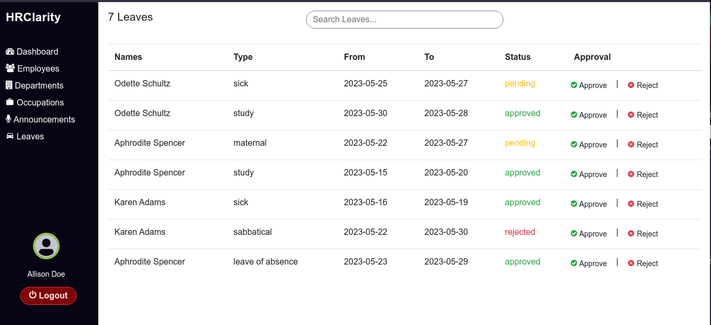
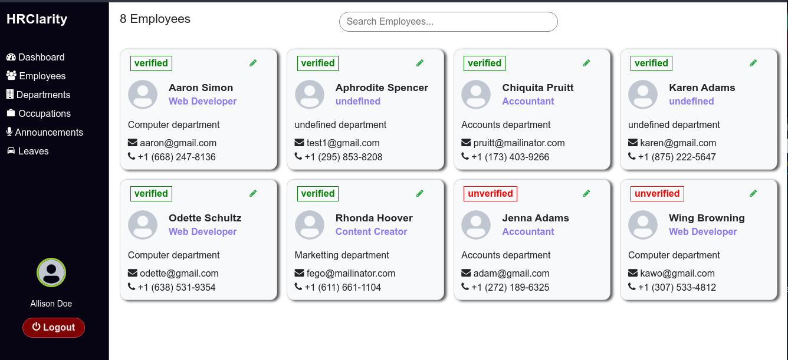
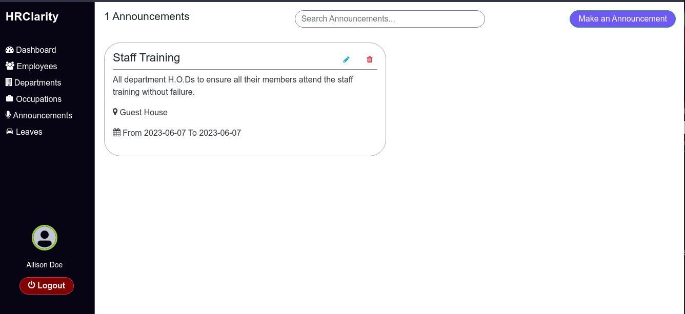

# HRClarity

HRClarity is a Human Resource Management System.

To view the deployed project, visit <a href="https://hrclarity.000webhostapp.com/">hrclarity.000webhostapp.com</a>

You can also connect with the author on Linkedin: <a href="https://www.linkedin.com/in/alexwambui/" target="_blank">AlexWambui</a>

It enables Human Resource Managers perform tasks such as:

- handling leaves.

- maintaining records of employees such as promotions, change of occupations and firing.

- making announcements.

the employees in the organization can be able to:

- create and update their user accounts.
- view announcements made by the HR.
- apply for leaves.

# Installation
- Ensure Xampp is installed
- Start Xampp and run Apache Web Server and MySQL database
- Clone the repository inside `/Xampp/htdocs`
- In the browser, search for `localhost/phpmyadmin` then import the database inside the folder `HRClarity/app/models/`
- Browser `localhost/HRClarity/` to start the project

# Usage
- To start using the application, click on get started then create an account
- Login and wait for the HR to verify that you're an employee of the organization.

# Contributing

The developer works tirelessly to improve and develop HRClarity. If you enjoy using the software, please consider donating to the developer, so he can spend more time implementing improvements. You can also contribute by getting involed with the source code.

## For devs
- Fork the repo
- play with it
- make pull requests

## For end-users
- Report bugs
- Suggest new features
- Be patient

# Built with
- HTML, Bootstrap, Sass - The User Interface.
- PHP - The Backend language.
- MySQL - Relational Database management system.

# Upcoming Features
- Chat for HRs to get feedback from employees.
- Email notifications for both HRs and employees.
